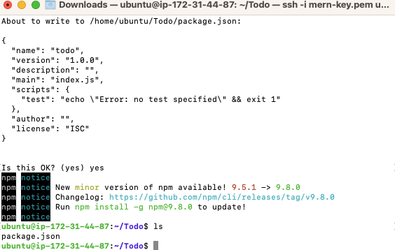
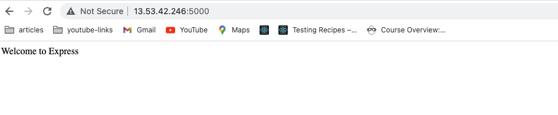
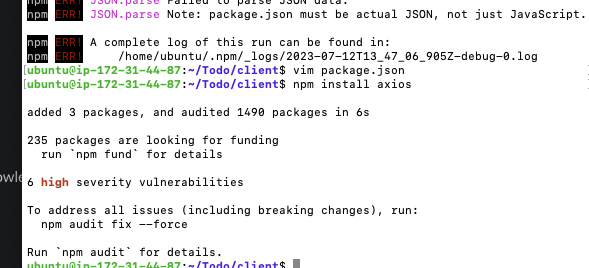
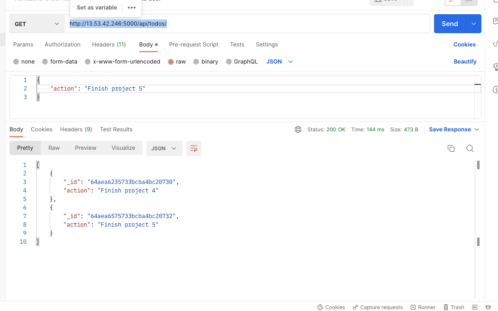
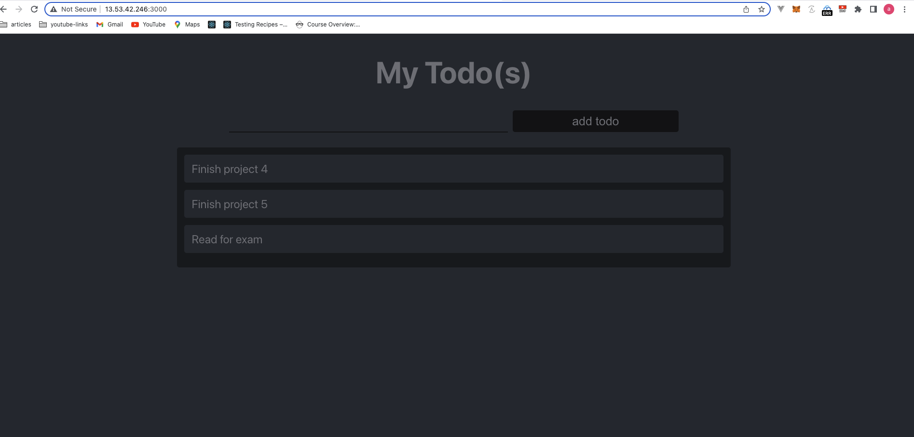

# Project1

# STEP 1

- Backend configuration
  - run _sudo apt update_ to update server's index package
  - run _apt-get install -y nodejs_ to install nodejs
  - Create Todo directory with `mkdir Todo`
  - run _npm init_
    

# STEP 2

- Installing expressjs

  - run _npm install express_ to install express(a nodejs framework)
  - run _touch index.js_ to create index.js file
  - run _npm install dotenv_ to install dotenv module
  - run _vim index.js_ to open index.js and paste the code below

    ```
        const express = require('express');
    require('dotenv').config();

    const app = express();

    const port = process.env.PORT || 5000;

    app.use((req, res, next) => {
    res.header("Access-Control-Allow-Origin", "\*");
    res.header("Access-Control-Allow-Headers", "Origin, X-Requested-With, Content-Type, Accept");
    next();
    });

    app.use((req, res, next) => {
    res.send('Welcome to Express');
    });

    app.listen(port, () => {
    console.log(`Server running on port ${port}`)
    });
    ```

    - Open port 5000 in EC2 security groups
    - Access _http://<PublicIP-or-PublicDNS>:5000_ in the browser
    - Create routes that will define various endpoints that the To-do app will depend on. _mkdir routes_ and _cd routes_
    - _touch api.js_
    - _vim api.js_ and paste the snippet below
      ```
      const express = require ('express');
      const router = express.Router();
      ```

    router.get('/todos', (req, res, next) => {

    });

    router.post('/todos', (req, res, next) => {

    });

    router.delete('/todos/:id', (req, res, next) => {

    })

    module.exports = router;

        ```



# STEP 3

- Models
- We need to create a model to define the mongodb(DB) schema
- cd into Todo folder and run _npm install mongoose_ to install mongoose
- mkdir models and create a todo.js file(touch todo.js).
- run _vim todo.js_ to open todo.js file and paste the below code in it.

  ```
      const mongoose = require('mongoose');
  const Schema = mongoose.Schema;

  //create schema for todo
  const TodoSchema = new Schema({
  action: {
  type: String,
  required: [true, 'The todo text field is required']
  }
  })

  //create model for todo
  const Todo = mongoose.model('todo', TodoSchema);

  module.exports = Todo;

  ```

  - Update api.js file from the routes folder to make use of the new model.

    ````
    const express = require ('express');
    const router = express.Router();
    const Todo = require('../models/todo');

            router.get('/todos', (req, res, next) => {

            //this will return all the data, exposing only the id and action field to the client
            Todo.find({}, 'action')
            .then(data => res.json(data))
            .catch(next)
            });

            router.post('/todos', (req, res, next) => {
            if(req.body.action){
            Todo.create(req.body)
            .then(data => res.json(data))
            .catch(next)
            }else {
            res.json({
            error: "The input field is empty"
            })
            }
            });

            router.delete('/todos/:id', (req, res, next) => {
            Todo.findOneAndDelete({"_id": req.params.id})
            .then(data => res.json(data))
            .catch(next)
            })

            module.exports = router;

        ```

    ````



# STEP 4

- MongoDB Database

  - Create a database on mongodb and copy the connection string
  - Create a .env file in Todo folder and add the connection string to access the database e.g _DB = 'mongodb+srv://<username>:<password>@<network-address>/<dbname>?retryWrites=true&w=majority'_
  - Update index.js file with the snippet below
  - start the server with _node index.js_

    ```
                const express = require('express');
        const bodyParser = require('body-parser');
        const mongoose = require('mongoose');
        const routes = require('./routes/api');
        const path = require('path');
        require('dotenv').config();

        const app = express();

        const port = process.env.PORT || 5000;

        //connect to the database
        mongoose.connect(process.env.DB, { useNewUrlParser: true, useUnifiedTopology: true })
        .then(() => console.log(`Database connected successfully`))
        .catch(err => console.log(err));

        //since mongoose promise is depreciated, we overide it with node's promise
        mongoose.Promise = global.Promise;

        app.use((req, res, next) => {
        res.header("Access-Control-Allow-Origin", "\*");
        res.header("Access-Control-Allow-Headers", "Origin, X-Requested-With, Content-Type, Accept");
        next();
        });

        app.use(bodyParser.json());

        app.use('/api', routes);

        app.use((err, req, res, next) => {
        console.log(err);
        next();
        });

        app.listen(port, () => {
        console.log(`Server running on port ${port}`)
        });

    ```



# STEP 5

-Frontend creation

- run _npx create-react-app client_ to bootstrap a react app. This will create a new folder called client.
- install concurrently _npm install concurrently --save-dev_
- install nodemon _npm install nodemon --save-dev_
- In Todo folder open the package.json file and replace the scripts with the snippet below.

  ```
      "scripts": {
  "start": "node index.js",
  "start-watch": "nodemon index.js",
  "dev": "concurrently \"npm run start-watch\" \"cd client && npm start\""
  },

  ```

- cd client
- Open package.json file and add _"proxy": "http://localhost:5000"_ .
- run _npm run dev_ .
- cd client
- mkdir components
- cd components
- touch Input.js ListTodo.js Todo.js
- Open Input.js file and paste the snippet below

  ```
          import React, { Component } from 'react';
      import axios from 'axios';

      class Input extends Component {

      state = {
      action: ""
      }

      addTodo = () => {
      const task = {action: this.state.action}

          if(task.action && task.action.length > 0){
          axios.post('/api/todos', task)
              .then(res => {
              if(res.data){
                  this.props.getTodos();
                  this.setState({action: ""})
              }
              })
              .catch(err => console.log(err))
          }else {
          console.log('input field required')
          }

      }

      handleChange = (e) => {
      this.setState({
      action: e.target.value
      })
      }

      render() {
      let { action } = this.state;
      return (
      <div>
      <input type="text" onChange={this.handleChange} value={action} />
      <button onClick={this.addTodo}>add todo</button>
      </div>
      )
      }
      }

      export default Input
  ```

- navigate to the clients folder
- run _npm install axios_ to install axiosa promise based HTTP client for the browser and nodejs
- navigate to the components directory
- Open ListTodo.js and paste the snippet below

  ```
      import React from 'react';

  const ListTodo = ({ todos, deleteTodo }) => {

  return (
  <ul>
  {
  todos &&
  todos.length > 0 ?
  (
  todos.map(todo => {
  return (
  <li key={todo._id} onClick={() => deleteTodo(todo._id)}>{todo.action}</li>
  )
  })
  )
  :
  (
  <li>No todo(s) left</li>
  )
  }
  </ul>
  )
  }

  export default ListTodo
  ```

- Open Todo.js file and paste the snippet below

  ```
      mport React, {Component} from 'react';
  import axios from 'axios';

  import Input from './Input';
  import ListTodo from './ListTodo';

  class Todo extends Component {

  state = {
  todos: []
  }

  componentDidMount(){
  this.getTodos();
  }

  getTodos = () => {
  axios.get('/api/todos')
  .then(res => {
  if(res.data){
  this.setState({
  todos: res.data
  })
  }
  })
  .catch(err => console.log(err))
  }

  deleteTodo = (id) => {

      axios.delete(`/api/todos/${id}`)
      .then(res => {
          if(res.data){
          this.getTodos()
          }
      })
      .catch(err => console.log(err))

  }

  render() {
  let { todos } = this.state;

      return(
      <div>
          <h1>My Todo(s)</h1>
          <Input getTodos={this.getTodos}/>
          <ListTodo todos={todos} deleteTodo={this.deleteTodo}/>
      </div>
      )

  }
  }

  export default Todo;
  ```

- Update the content of App.js in clients. Paste the code below

  ```
      import React from 'react';

  import Todo from './components/Todo';
  import './App.css';

  const App = () => {
  return (
  <div className="App">
  <Todo />
  </div>
  );
  }

  export default App;
  ```

- Update App.css file in client

  ```
          .App {
      text-align: center;
      font-size: calc(10px + 2vmin);
      width: 60%;
      margin-left: auto;
      margin-right: auto;
      }

      input {
      height: 40px;
      width: 50%;
      border: none;
      border-bottom: 2px #101113 solid;
      background: none;
      font-size: 1.5rem;
      color: #787a80;
      }

      input:focus {
      outline: none;
      }

      button {
      width: 25%;
      height: 45px;
      border: none;
      margin-left: 10px;
      font-size: 25px;
      background: #101113;
      border-radius: 5px;
      color: #787a80;
      cursor: pointer;
      }

      button:focus {
      outline: none;
      }

      ul {
      list-style: none;
      text-align: left;
      padding: 15px;
      background: #171a1f;
      border-radius: 5px;
      }

      li {
      padding: 15px;
      font-size: 1.5rem;
      margin-bottom: 15px;
      background: #282c34;
      border-radius: 5px;
      overflow-wrap: break-word;
      cursor: pointer;
      }

      @media only screen and (min-width: 300px) {
      .App {
      width: 80%;
      }

      input {
      width: 100%
      }

      button {
      width: 100%;
      margin-top: 15px;
      margin-left: 0;
      }
      }

      @media only screen and (min-width: 640px) {
      .App {
      width: 60%;
      }

      input {
      width: 50%;
      }

      button {
      width: 30%;
      margin-left: 10px;
      margin-top: 0;
      }
      }
  ```

- Update index.css file with the snippet below

  ```
          body {
      margin: 0;
      padding: 0;
      font-family: -apple-system, BlinkMacSystemFont, "Segoe UI", "Roboto", "Oxygen",
      "Ubuntu", "Cantarell", "Fira Sans", "Droid Sans", "Helvetica Neue",
      sans-serif;
      -webkit-font-smoothing: antialiased;
      -moz-osx-font-smoothing: grayscale;
      box-sizing: border-box;
      background-color: #282c34;
      color: #787a80;
      }

      code {
      font-family: source-code-pro, Menlo, Monaco, Consolas, "Courier New",
      monospace;
      }
  ```

- navigate to the Todo directory and run _npm run dev_

  
